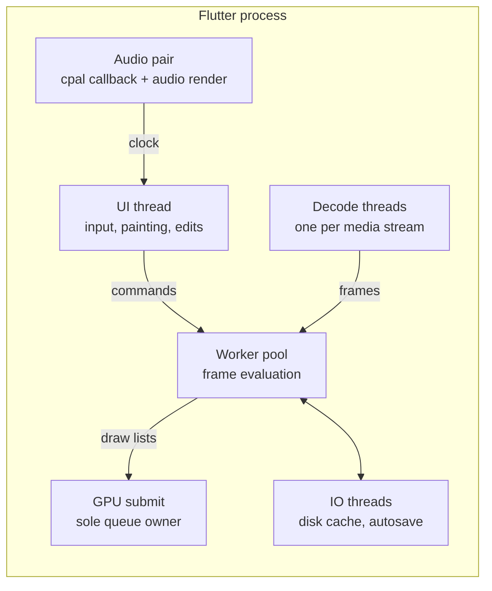
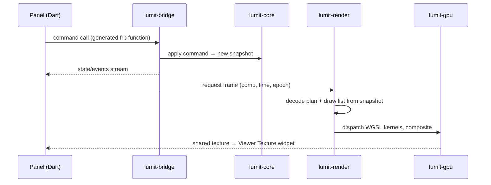

# The map

One page to orient every change. Details live in the numbered docs beside this one.

## What Lumit is, structurally

Three programs in one repo:

1. **The engine** — a Rust workspace under `crates/`. It owns the document, time,
   decoding, rendering, audio and caching. It never knows a UI exists.
2. **The frontend** — a Flutter app under `flutter_ui/`. It owns pixels on screen,
   input, panels and strings. It holds no document state of its own.
3. **The seam** — `crates/lumit-bridge`, compiled as a dynamic library. Flutter calls
   it through generated code (`flutter_rust_bridge`). The contract is
   [17-BRIDGE-CONTRACT.md](../17-BRIDGE-CONTRACT.md).

Two more, off to the side: `web/` (lumitlab.com) and `web-docs/` (docs.lumitlab.com),
small Astro sites that nothing else depends on.

## The crates

Dependencies point down. Nothing depends on the bridge; the engine compiles without it.

```mermaid
graph TD
    FL[flutter_ui &#40;Dart&#41;] --> BR[lumit-bridge]
    BR --> RE[lumit-render]
    BR --> KM[lumit-keymap]
    BR --> PJ[lumit-project]
    BR --> AU[lumit-audio]
    RE --> FLW[lumit-flow]
    RE --> GPU[lumit-gpu]
    RE --> ME[lumit-media]
    RE --> CA[lumit-cache]
    RE --> TX[lumit-text]
    RE --> PJ
    RE --> AU
    FLW --> GPU
    GPU --> EV[lumit-eval]
    AU --> ME
    EV --> CO[lumit-core]
    GPU --> CO
    PJ --> CO
    RE --> CO
```

(Exact edges from each crate's `Cargo.toml`. `lumit-bridge` also depends on
`lumit-core` and `lumit-eval` directly; `lumit-cache`, `lumit-keymap`,
`lumit-media` and `lumit-text` depend on no other Lumit crate at all.)

| Crate | One line |
|---|---|
| `lumit-core` | The document model and the four rational time types. Pure data. No IO, no GPU, no threads. |
| `lumit-eval` | "Nova": frame keys, graph compiler, cancellation epochs, worker pool, scheduler core. |
| `lumit-render` | The pixel pass: decode planning, draw lists, compositor driving, export, the headless renderer. |
| `lumit-gpu` | The one wgpu device, every WGSL effect kernel, colour, scopes, readback. |
| `lumit-flow` | DIS optical flow: CPU oracle plus WGSL twin. |
| `lumit-media` | FFmpeg (via rsmpeg) demux/decode/encode and the frame index. |
| `lumit-audio` | "Pulsar": cpal output, the master audio clock, mixing, beat detection. |
| `lumit-cache` | "Nebula": RAM + disk frame cache, content-hash keys, byte-budget eviction. |
| `lumit-project` | `.lum` read/write, the operation journal, autosave, recovery. |
| `lumit-text` | Text rasterisation. |
| `lumit-keymap` | Chords, contexts, actions, bindings, clash resolution. |
| `lumit-bridge` | The whole API surface Flutter calls. A frontend leaf, not an engine crate. |

## The threads

Fixed roles; work moves between them through bounded channels and snapshots, never
through shared mutable state.

Rules that make it safe (details: [05-ARCHITECTURE.md](../05-ARCHITECTURE.md) §2):

- The UI thread never evaluates, decodes or blocks on a render.
- Edits produce a new immutable document snapshot; workers keep the one they started
  with. Publication is one atomic pointer swap.
- Every render request carries an **epoch**; scrubbing bumps it; stale jobs stop at
  the next check.
- The audio clock is master. Video drops frames; audio never waits.

## From a click to pixels

## Where do I change X

Filled in per area; each row names the first file to open.

| I want to change… | Start in | Doc |
|---|---|---|
| What a layer/property/keyframe *is* | `crates/lumit-core/src/` | [01-CORE.md](01-CORE.md) |
| How an edit applies, undo | `lumit-core` commands | [01-CORE.md](01-CORE.md) |
| Save format, autosave | `crates/lumit-project` | [01-CORE.md](01-CORE.md) |
| How a frame gets rendered | `crates/lumit-render` | [02-PIXELS.md](02-PIXELS.md) |
| An effect's look (GPU) | `crates/lumit-gpu/src/fx_*.wgsl` | [03-GPU.md](03-GPU.md) |
| Decoding, formats | `crates/lumit-media` | [04-MEDIA-AUDIO.md](04-MEDIA-AUDIO.md) |
| Playback sync, audio | `crates/lumit-audio` | [04-MEDIA-AUDIO.md](04-MEDIA-AUDIO.md) |
| What the UI can ask the engine | `crates/lumit-bridge/src/api/` | [05-BRIDGE.md](05-BRIDGE.md) |
| A panel's behaviour or look | `flutter_ui/lib/panels/` | [06-FRONTEND.md](06-FRONTEND.md) |
| A menu, dialog, shortcut | `flutter_ui/lib/shell/` + `lumit-keymap` | [06-FRONTEND.md](06-FRONTEND.md) |
| Any user-facing string | `flutter_ui/lib/l10n/app_en.arb` | [07-BUILD-SHIP.md](07-BUILD-SHIP.md) |
| CI, tests, packaging | `.github/workflows/` | [07-BUILD-SHIP.md](07-BUILD-SHIP.md) |
