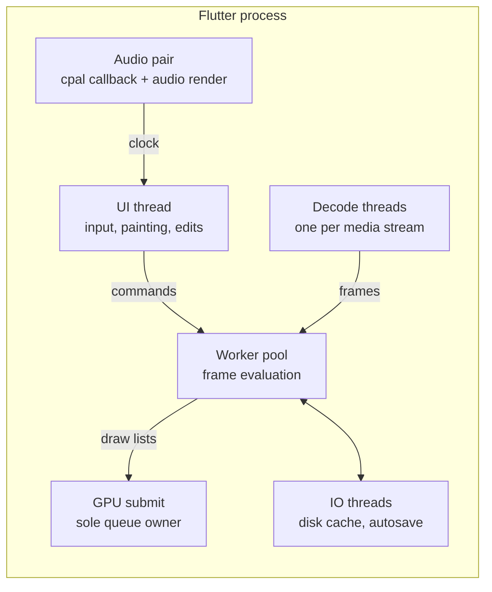
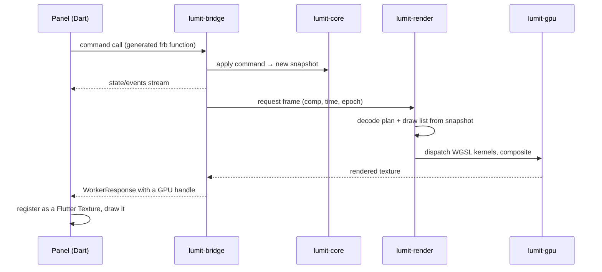

# The map

One page to orient every change. Details live in the numbered docs beside this one.

## What Lumit is, structurally

Three programs in one repo:

1. **The engine** — a Rust workspace under `crates/`. It owns the document, time,
   decoding, rendering, audio and caching. It never knows a UI exists.
2. **The frontend** — a Flutter app under `flutter_ui/`. It owns pixels on screen,
   input, panels and strings. It holds no document state of its own.
3. **The seam** — `crates/lumit-bridge`, compiled as a dynamic library. Flutter calls
   it through generated code (`flutter_rust_bridge`). The contract is
   [17-BRIDGE-CONTRACT.md](../17-BRIDGE-CONTRACT.md).

Two more sit off to the side: `web/` (lumitlab.com) and `web-docs/`
(docs.lumitlab.com). They are small Astro sites that nothing else depends on.

## Six words to learn first

Defined here once. The other guides use them without re-explaining.

**Comp → Layer → Clip.** A **composition** is a timeline with a fixed size, frame
rate and duration. It holds an ordered stack of **layers**, index 0 on top. Most
layers have one source. A **Sequence layer** is the exception: it holds an ordered
run of **clips** cut back-to-back on its single row. "Clip" means only that. It is
never a general word for a layer or a piece of footage.

**Snapshot.** The document is immutable. An edit produces a complete new copy, and
one atomic pointer swap publishes it. Anything mid-render keeps the copy it started
with. Nobody ever sees a half-applied edit, so no lock sits between editing and
rendering.

**Epoch.** A generation number carried by every render request. Moving the playhead
bumps it. Workers compare their token against it and stop at the next check. Nothing
is force-killed. Work always stops by asking, never by interruption.

**Retime.** One system that maps a layer's own time to source time. It lives on
Footage and Precomp layers, or on each clip inside a Sequence layer. The graph
editor shows it two ways: the value lens (After Effects time remapping) and the
speed lens (Vegas velocity). There is no separate "time remap" feature.

**Content hash.** Frames are named by what went into them, never by timeline
position. Identical content hashes identically. Reuse therefore needs no
invalidation logic, and an edit renames exactly the frames it changed.

**Working space.** The engine's internal pixel format: scene-linear, premultiplied
alpha, fp16. Colour maths happens in light, not in gamma-encoded values.

Full terminology lives in [01-GLOSSARY.md](../01-GLOSSARY.md), which is binding on
code, comments and commit messages.

## The crates

Dependencies point down. Nothing depends on the bridge, so the engine compiles
without it.

```mermaid
graph TD
    FL[flutter_ui &#40;Dart&#41;] --> BR[lumit-bridge]
    BR --> RE[lumit-render]
    BR --> KM[lumit-keymap]
    BR --> PJ[lumit-project]
    BR --> AU[lumit-audio]
    RE --> FLW[lumit-flow]
    RE --> GPU[lumit-gpu]
    RE --> ME[lumit-media]
    RE --> CA[lumit-cache]
    RE --> TX[lumit-text]
    RE --> PJ
    RE --> AU
    FLW --> GPU
    GPU --> EV[lumit-eval]
    AU --> ME
    EV --> CO[lumit-core]
    GPU --> CO
    PJ --> CO
    RE --> CO
```

(Exact edges from each crate's `Cargo.toml`. `lumit-bridge` also depends on
`lumit-core` and `lumit-eval` directly. `lumit-cache`, `lumit-keymap`,
`lumit-media` and `lumit-text` depend on no other Lumit crate at all.)

Each name links to the source. Each guide covers the crates it names.

| Crate | One line | Guide |
|---|---|---|
| [`lumit-core`](../../crates/lumit-core/src/) | The document model and the four rational time types. Pure data. No IO, no GPU, no threads. | [01](01-CORE.md) |
| [`lumit-fx-macros`](../../crates/lumit-fx-macros/src/) | A proc-macro crate, used only by `lumit-core`: `#[derive(Effect)]` writes an effect's schema and parameter reader from one struct. | [01](01-CORE.md) |
| [`lumit-eval`](../../crates/lumit-eval/src/) | "Nova": frame keys, graph compiler, cancellation epochs, worker pool, scheduler core. | [02](02-PIXELS.md) |
| [`lumit-render`](../../crates/lumit-render/src/) | The pixel pass: decode planning, draw lists, compositor driving, export, the headless renderer. | [02](02-PIXELS.md) |
| [`lumit-cache`](../../crates/lumit-cache/src/) | "Nebula": RAM + disk frame cache, content-hash keys, byte-budget eviction. | [02](02-PIXELS.md) |
| [`lumit-gpu`](../../crates/lumit-gpu/src/) | The one wgpu device, every WGSL effect kernel, colour, scopes, readback. | [03](03-GPU.md) |
| [`lumit-flow`](../../crates/lumit-flow/src/) | DIS optical flow: CPU oracle plus WGSL twin. | [03](03-GPU.md) |
| [`lumit-media`](../../crates/lumit-media/src/) | FFmpeg (via rsmpeg) demux/decode/encode and the frame index. | [04](04-MEDIA-AUDIO.md) |
| [`lumit-audio`](../../crates/lumit-audio/src/) | "Pulsar": cpal output, the master audio clock, mixing, beat detection. | [04](04-MEDIA-AUDIO.md) |
| [`lumit-project`](../../crates/lumit-project/src/) | `.lum` read/write, the operation journal, autosave, recovery. | [01](01-CORE.md) |
| [`lumit-text`](../../crates/lumit-text/src/) | Text rasterisation. | [04](04-MEDIA-AUDIO.md) |
| [`lumit-keymap`](../../crates/lumit-keymap/src/) | Chords, contexts, actions, bindings, clash resolution. | [04](04-MEDIA-AUDIO.md) |
| [`lumit-bridge`](../../crates/lumit-bridge/src/) | The whole API surface Flutter calls. A frontend leaf, not an engine crate. | [05](05-BRIDGE.md) |

## The threads

Threads have fixed roles. Work moves between them through bounded channels and
snapshots, never through shared mutable state.

Rules that make it safe (details: [05-ARCHITECTURE.md](../05-ARCHITECTURE.md) §2):

- The UI thread never evaluates, decodes or blocks on a render.
- Edits produce a new immutable document snapshot. Workers keep the one they started
  with. Publication is one atomic pointer swap.
- Every render request carries an **epoch**. Scrubbing bumps it. Stale jobs stop at
  the next check.
- The audio clock is master. Video drops frames. Audio never waits.

## From a click to pixels

Pixels never cross the seam. The engine hands over a shared-texture handle and
Flutter draws it directly.

## Where do I change X

Each row names the first file to open.

| I want to change… | Start in | Doc |
|---|---|---|
| What a layer/property/keyframe *is* | `crates/lumit-core/src/` | [01-CORE.md](01-CORE.md) |
| How an edit applies, undo | `lumit-core` commands | [01-CORE.md](01-CORE.md) |
| Save format, autosave | `crates/lumit-project` | [01-CORE.md](01-CORE.md) |
| How a frame gets rendered | `crates/lumit-render` | [02-PIXELS.md](02-PIXELS.md) |
| An effect's look (GPU) | `crates/lumit-gpu/src/fx_*.wgsl` | [03-GPU.md](03-GPU.md) |
| An effect's controls | `lumit-core/src/fx/effects/<name>.rs` — one file per effect | [01-CORE.md](01-CORE.md) |
| Decoding, formats | `crates/lumit-media` | [04-MEDIA-AUDIO.md](04-MEDIA-AUDIO.md) |
| Playback sync, audio | `crates/lumit-audio` | [04-MEDIA-AUDIO.md](04-MEDIA-AUDIO.md) |
| What the UI can ask the engine | `crates/lumit-bridge/src/api/` | [05-BRIDGE.md](05-BRIDGE.md) |
| A panel's behaviour or look | `flutter_ui/lib/panels/` | [06-FRONTEND.md](06-FRONTEND.md) |
| A menu, dialog, shortcut | `flutter_ui/lib/shell/` + `lumit-keymap` | [06-FRONTEND.md](06-FRONTEND.md) |
| Any user-facing string | `flutter_ui/lib/l10n/app_en.arb` | [07-BUILD-SHIP.md](07-BUILD-SHIP.md) |
| CI, tests, packaging | `.github/workflows/` | [07-BUILD-SHIP.md](07-BUILD-SHIP.md) |
| The website or the docs site | `web/` or `web-docs/` | [08-WEBSITES.md](08-WEBSITES.md) |

## Never edit these by hand

Four trees are machine-written. Editing one directly is always the wrong move,
because the next build overwrites it. Change the source on the left instead.

| Generated tree | Written from | Regenerate with |
|---|---|---|
| `flutter_ui/lib/src/rust/**` and `crates/lumit-bridge/src/frb_generated.rs` | `crates/lumit-bridge/src/api/**` | `flutter_rust_bridge_codegen generate` (from `flutter_ui/`) |
| `flutter_ui/lib/l10n/gen/**` | `flutter_ui/lib/l10n/app_en.arb` | `flutter pub get` (from `flutter_ui/`) |
| `flutter_ui/lib/l10n/app_<locale>.arb` (every file except `app_en.arb`) | The site's translation page | `scripts/translations.ps1` ingest. A hand edit is overwritten by the next run |
| `flutter_ui/rust_builder/cargokit/**` | Vendored upstream | Nothing. Do not modify |

The first two fail CI when stale. The third fails silently, which is worse: your
translation survives until the next sync, then disappears.

## Your first change, end to end

The loop for a small engine change. Adjust the middle for a frontend change.

1. **Find the area.** Use the table above. Read that guide's "Traps" section before
   editing anything.
2. **Read the spec.** Each guide names its canonical doc in `docs/`. Where code and
   docs disagree, the docs win.
3. **Change the code and its test together.** Near-full regression coverage is
   policy. A bug fix lands with a test that fails without the fix.
4. **Run the crate's tests.** `cargo test -p lumit-core`. GPU tests always need
   `-- --test-threads=1`.
5. **Run the gates locally.** `cargo fmt --all`, then
   `cargo clippy --workspace --all-targets -- -D warnings`. Both block merge.
6. **Regenerate if you touched a boundary.** See the table above.
7. **Update the docs in the same commit.** A new crate or mechanism means a line in
   [GUIDE.md](../GUIDE.md). A reversed rule means the spec that carries it changes too.

Two rules catch most newcomers. Every user-facing string goes through
`app_en.arb`, and a string the *engine* sends also needs an `engine_labels.dart`
entry. No colour literal may appear outside `flutter_ui/lib/theme/`.
