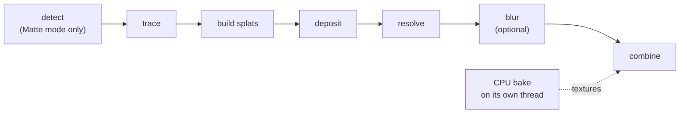

# The graphics card: lumit-gpu and lumit-flow

`lumit-gpu` owns the one wgpu device, every WGSL kernel, the compositor, colour and
scopes. `lumit-flow` measures motion between two frames. Neither knows the document
model: they take plain numbers. `lumit-core` is a **dev**-dependency of `lumit-gpu`
only. That is where the CPU oracles live.

Specs: [06-RENDER-PIPELINE.md](../06-RENDER-PIPELINE.md),
[08-EFFECTS.md](../08-EFFECTS.md). Impl notes: `gpu-foundation.md`,
`anti-aliasing.md`, `lens-flare.md`, `lut.md`, `optical-flow.md`.

To learn the shader language itself, read [WGSL.md](WGSL.md).

> **First pass:** `GpuContext` wraps the one wgpu device, and one `CommandEncoder`
> carries every pass of a frame. Every `.wgsl` file is a complete standalone module.
> The working format is `Rgba16Float`: scene-linear, premultiplied alpha. Every
> kernel mirrors a CPU function in `lumit_core::fx::cpu`, the reference (K-019).
>
> Skip to [Optical flow: lumit-flow](#optical-flow-lumit-flow) for motion measurement.

## The device

`GpuContext` (`src/lib.rs`) wraps one wgpu `Device` + `Queue`.

- `headless()` pins the backend per OS (DX12 / Vulkan / Metal, K-205) so the
  zero-copy Viewer's low-level reach-through always finds the expected backend.
- `begin_frame`/`end_frame` batch every pass into **one** `CommandEncoder`.
  `submits_so_far()` counts submissions, so "a frame submits once, not once per
  layer" is a test, not a hope.
- `reclaim()` must run each worker-loop turn (`Maintain::Poll`). The driver frees
  dropped textures only on a maintain. A missed maintain looks exactly like a leak
  (K-277/K-294).
- The code asks for multisample support, never assumes it (`supported_sample_count`).

## How a kernel is built

No includes, no preprocessor, no string concatenation. Every `.wgsl` file is a
complete standalone module, compiled at engine construction via `include_str!`
(`src/fx/engine.rs`). Lumit deliberately duplicates shared helpers such as
`bilinear` and `unpremult` in each file. Each copy carries an annotation that names
the CPU function it mirrors. `tests/wgsl_validates.rs` runs naga over every shader,
so a broken shader fails on a machine with no GPU (K-263).

Four bind-group layouts cover the ~35 catalogue effects. The lens flare and the lighting
pass build their own, because neither is a one-kernel image op:

| Layout | Bindings |
|---|---|
| shared (most effects) | 0 `src`, 1 `orig`, 2 `dst` storage, 3 uniform |
| adjust | below / processed / coverage |
| mb | src / orig / flow (also datamosh, depth of field) |
| lut | shared + 3D cube at binding 4 |

Every dispatch is `div_ceil(w, 8) × div_ceil(h, 8)`. Parameters travel as
`#[repr(C)] bytemuck::Pod` structs mirrored field-for-field with the WGSL struct,
hand-padded to 16-byte rows.

Two passes in this crate are not effects at all, and it is worth knowing why. `fx/lighting.rs` and
`fx_lighting.wgsl` shade a layer with the comp's Light layers (K-361): no `Resolved`
variant, no docs/08 entry, called directly by the realiser between a layer's stack and its
composite. `scope.wgsl` is the same sort of thing for measurement. Both restate their types
locally, because an engine GPU crate does not depend on the model crate — and for lighting
the oracle it is compared against is `lumit_core::lighting`.

## The lens flare

Worth its own section: it is the only effect here that is a small pipeline rather than a
kernel, and the one place the usual rules bend. `fx/lens_flare.rs` drives five shaders.
Read `docs/impl/lens-flare.md` first.

1. **Detect** — in Matte mode the flare's sources are found on the card: two small kernels
   pick the brightest points of the matte layer.
2. **Trace** — a few hundred thousand tiny ray programs push light through the chosen lens,
   once per source. Wavelength bands, ghost pairs and four-bounce ghosts are all rays here.
3. **Build splats** — each surviving ray becomes a footprint: a centre and two half-axes in
   flare-buffer pixels, with its peak colour.
4. **Deposit** — each footprint is accumulated over the pixels it covers. Big splats deposit
   into a **pyramid** of half-size levels (K-380) so that one enormous splat cannot cost
   more than a bounded number of writes.
5. **Resolve** — the accumulator is written into the fp16 flare buffer, once.
6. **Blur**, when Ghost softness asks for it — a separable box blur over the flare buffer,
   horizontal + vertical × 3 to approximate a Gaussian.
7. **Combine** — the flare buffer plus the baked starburst sprite are laid over the picture.

Three of its choices explain most of the code:

- **The slow maths never runs here.** The Fourier transforms that give the starburst and the
  ghost-edge diffraction are baked on the CPU (`lumit_core::fx::lens_flare`) and arrive as
  textures, cached by parameter hash. `lumit-gpu` stays `lumit-core`-free in production, so
  the caller converts and hands over a `FlareBakeData`.
- **The bake has its own thread** (K-350). `Baker` owns a queue and a finished channel; a key
  already in flight is not queued twice, and a machine that will not give us a thread bakes
  inline instead. A frame whose bake has not landed renders live and banks nothing rather
  than caching an incomplete picture.
- **The accumulator is fixed-point integers, not floats** (K-375/K-377). Until K-375 the
  deposit was an additive hardware raster of one quad per ray, straight into the fp16 flare
  buffer — and adding a small increment to a large fp16 running sum systematically loses
  everything under half an ULP of the sum. Measured against the f32 CPU reference the middle
  of the frame came out 4.5 % dim. WGSL has no float atomics, and a compare-and-swap loop
  over the bit pattern is exact per add but sums in whatever order the threads race to,
  which is not deterministic. Integer addition *is* associative, so every deposit rounds to
  a fixed step and `atomicAdd`s exactly: one rounding at the resolve instead of thousands,
  and the same picture every time.

The flare's long-running bit-stability failure was two separate versions of that same lesson,
and both are worth carrying to any other scatter pass. **Hardware 4× multisampling was the
first** (K-353): additively blending fp16 into a multisample target came back a few ULPs
different each run, in different places. The antialiasing was kept and the hardware dropped —
barycentric coordinates are affine in screen position, so a fragment can evaluate its own
coverage exactly instead of sampling it. That also deleted the effect's largest allocation, a
~66 MB multisample texture at a 1080p flare buffer. **The fp16 accumulation was the second**,
above. The general shape: if many threads add into one place, ask what the *order* and the
*precision* of those adds are, because a GPU promises neither.

Its pipelines compile on a background thread (`LazyFlare`), because they are built from the
device alone and nothing needs them until the first flare is drawn. That took worker start
from about 7.7 s to 1.1 s. The two per-frame questions — is a bake pending, what generation
are we on — ask `ready()` rather than `get()`, so neither can be the thing that waits for a
compile.

Two sibling effects share the neighbourhood without sharing the machinery:
`fx_sprite_flare.wgsl` draws a flare where you put one (K-359 — a different question from
"what would this lens do", deliberately a separate effect), and `fx_light_wrap.wgsl` screens
a blurred background over the inside of a foreground's alpha edge.

## Pixel format and colour

`WORKING_FORMAT = Rgba16Float`: scene-linear, premultiplied alpha. The only two sRGB
crossings live in `ColourEngine`. Neither contains gamma arithmetic. The hardware
does it. `linearise` samples an `Rgba8UnormSrgb` view into fp16. `display` renders
fp16 into an sRGB target. A golden test proves the round trip within 1 LSB (K-031).

Viewer gain and tone map (`DisplayParams`) are preview-only and short-circuit at
neutral, so exports stay bit-identical (K-314). `oklab.rs` and `oklab.wgsl` are a
CPU/GPU pair with identical constants. OkLCh shortest-arc interpolation is the
gradient primitive (K-034). LUTs upload as `rgba32float` 3D textures, and the kernel
does its **own** trilinear filter. The reason is that hardware 3D filtering is not
bit-guaranteed across cards (K-271).

## The compositor

Layers draw bottom-up as textured quads through a full 4×4 matrix, premultiplied-over
in linear light. Normal, Add and Multiply are fixed-function blend states. The other
23 modes are "snapshot" blends: the compositor makes a copy of the target, and the
fragment composites itself. A copy cannot happen inside a pass, so drawing splits
into segments.

Motion-blur averaging and accumulation sum into `Rgba32Float` ping-pong targets and
round **once** at the resolve, so a still scene averages back bit-for-bit.

## Scopes and readback

Scopes are three compute passes (K-096): `bin` counts samples with `atomicAdd`,
`peak_reduce` takes an `atomicMax`, `colourise` paints a 256×256 trace. Only the
trace reads back.

`readback8` pads rows to `COPY_BYTES_PER_ROW_ALIGNMENT`, maps, then tightens.
`start_readback8` is the non-blocking sibling, polled on later turns. Cache demotion
never stalls a render.

## Oracles: how correctness is defined

Every kernel mirrors a `lumit_core::fx::cpu` function operation for operation. The
CPU version is the reference (K-019). `fx/tests.rs` uploads a quantised corpus
(gradient, alpha edge, HDR spike), runs both paths, and asserts a per-class tolerance
plus bit-stability across reruns. Tests skip without an adapter unless
`LUMIT_REQUIRE_GPU` is set. CI sets it.

Parity means **arithmetic-order parity**: explicit left-to-right reductions instead
of `mix()`, host-computed `cos`/`sin` (WGSL trig is not correctly rounded),
`floor(x + 0.5)` instead of `round()`, and `splitmix32` because WGSL has no 64-bit
integers.

## Optical flow: lumit-flow

Given frames A and B, DIS (Dense Inverse Search) computes per-pixel motion:

1. A coarse-to-fine pyramid, halving to ~24 px.
2. At each level, every 8×8 patch refines its vector by inverse-compositional
   Gauss–Newton — the template Hessian is fixed, only B is re-sampled.
3. Densify: covering patches vote, weighted by photometric fit.
4. One bilateral smooth, then variational refinement (K-332) over the whole field.
5. Forward–backward disagreement gives the occlusion mask and a confidence plane.

`src/lib.rs` is the CPU oracle. `src/dis.wgsl` mirrors it line for line and must
agree within 1e-3. `synth.wgsl` synthesises in-between frames and is bit-*tolerant*,
not bit-identical. `FlowEngine` uses the GPU where pipelines build and degrades
permanently to CPU on any GPU error. Consumers: Retime flow interpolation, Fast
motion blur, Datamosh.

## Traps

- **Uniform alignment is load-bearing.** WGSL aligns `array<vec4<f32>, N>` to 16
  bytes. `fx_hue.wgsl` passes a 3×3 as nine scalar fields for exactly this reason.
  A mismatch cost 17 920 fp16 ULP once.
- **Bounds-check every kernel.** Dispatch rounds up to whole 8×8 workgroups, so edge
  threads land outside the image.
- **`workgroupBarrier()` must sit in uniform control flow.** The flare blur makes
  out-of-range threads load zeroes and still reach the barrier before returning.
- **fp16 rounds where f32 does not.** Software rasterisers (lavapipe, WARP) land 1
  LSB from hardware. `GpuContext::software` relaxes bit-exact claims accordingly.
- **Fixed-function surprises.** A pipeline bakes its sample count. Copies cannot
  cross sample counts. ANGLE silently refuses non-BGRA legacy share handles, which
  gives a black Viewer with no error anywhere.
- **A long submission trips the OS watchdog** and kills the device. The lens flare splits
  command buffers on a cost model that counts the trace's ray–surface steps *and* the
  deposit's pixels (K-379): a wide, soft flare is nearly all deposit, so pacing on the trace
  alone let exactly that case run long.
- **No float atomics in WGSL**, and a CAS loop over an f32 sums in thread-race order. Any
  scatter that many threads add into needs integer atomics on a fixed-point accumulator if
  the picture is to be the same twice (K-375).
