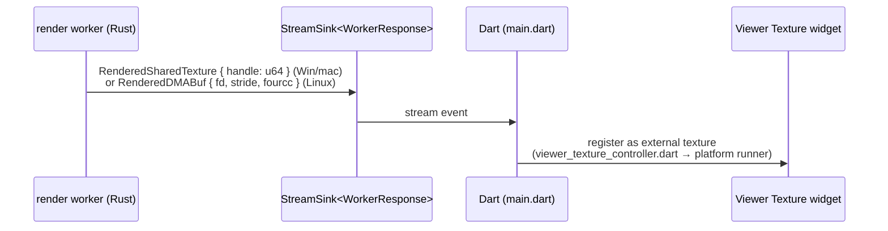

# The seam: lumit-bridge and lumit-keymap

`lumit-bridge` is the whole surface the Flutter frontend can call. It is a frontend
leaf — engine crates never depend on it. The canonical contract is
[17-BRIDGE-CONTRACT.md](../17-BRIDGE-CONTRACT.md); this doc is the tour of the code
that implements it.

## Generated, not hand-written

You write ordinary Rust in `crates/lumit-bridge/src/api/**`. Then
`flutter_rust_bridge_codegen generate` (run from `flutter_ui/`) writes both sides of
the glue: `src/frb_generated.rs` (Rust) and `flutter_ui/lib/src/rust/` (Dart — one
`api/*.dart` per Rust api module). Neither is ever edited by hand.

Both sides embed the same content hash; a stale library refuses to start. There is
no ABI version and no degraded mode — which is also why Flutter widget tests can
drive the real engine.

Attributes shape what Dart sees:

| Attribute | Effect |
|---|---|
| `#[frb(sync)]` | Runs on Dart's UI isolate. Only for fast calls — `save` is deliberately async |
| *(none)* | Async on frb's shared worker pool |
| `#[frb(non_opaque)]` | Struct/enum mirrored into Dart fields |
| `#[frb(opaque)]` | Stays a Rust-held handle (e.g. `BridgeEffectInstance`) |
| `#[frb(ignore)]` | Internal; hidden from Dart |

## API shape: references, not snapshots

One module per panel-sized concern (`api/project.rs`, `composition.rs`, `layer.rs`,
`effect.rs`, `footage.rs`, `keymap.rs`, `audio.rs`, `export.rs`, `cache.rs`, …).
Dart holds small reference handles — `ProjectReference { id }`,
`CompositionReference { project, id }`, `LayerReference { project, comp, layer }` —
and calls methods on them. No document snapshot ever crosses the seam; readers ask
the handle (`comp.get_layers()`, `layer.get_switches()`).

## State and locks

Process-wide statics in `api/state.rs`:

- `PROJECTS: LazyLock<RwLock<BTreeMap<Uuid, Arc<RwLock<LumitBridgeState>>>>>`
- `STREAMS` — the per-project change sinks (a second registry, so the observer can
  reach a sink while a project lock is held)

`LumitBridgeState` holds the `DocumentStore` (document + undo), the file path, the
media cache, the crash-journal handle and the render worker's `Sender`.

The lock order is written down at `state.rs:298` and is law: take a registry, clone
the `Arc` out, drop the guard; then one project `RwLock`; the observer touches only
STREAMS and the journal. Readers clone `store.snapshot()` (an `Arc<Document>`),
drop the guard, then work. Never hold a lock across an await, a GPU call, or a
render.

## Edits: one gesture, one op, one undo step

A UI action calls one method on a reference. The method builds one
`lumit_core::Op` and commits it (`layer.rs:3352` is the pattern). Ops carry whole
values — an entire animation, an entire effect stack — never granular deltas.

Drags do not commit. `render_frame_with_preview` and its siblings
(`…with_transform_`, `…with_text_`, `…with_paint_`, `…with_mask_`, `…with_retime`)
patch an engine-side clone per tick; mouse-up commits once. `set_effects` refuses a
reordered stack (`StaleEffectStack`) rather than guessing.

Every keyframe crosses on the **composition's clock**; conversion by the layer's
`start_offset` happens at the seam (K-213).

## Events: Rust → Dart

`DocumentStore`'s observer fires on every commit: append the op to the crash
journal, compute `op_scope(&op)` (an exhaustive match — a new `Op` variant is a
compile error here), push a `ScopedChange { project, item, layer, items }` down the
project's `StreamSink`. Dart listens in `main.dart` and rebuilds only the named
subtree. Edits invalidate nothing: frames are named by content hash, so an edit
renames exactly the frames it changed.

## Frames: a handle, not pixels

`ProjectReference::start_worker(stream)` spawns the render worker thread. Render
and playback requests are `#[frb(sync)]` channel sends; the worker owns a
`HeadlessRenderer` outright — no lock — and drains its queue latest-wins per class
(scrub frames supersede each other; Play/Stop are kept).

Publishing is zero-copy only (K-177/K-183):

The only pixel payloads that cross as bytes are bounded stills: thumbnails,
256×256 scope traces, ≤129×129 colour-dropper windows (capped engine-side).
Playback lives in the worker (K-181): it renders ahead into a ring sized by p95
frame cost, presents on a time grid, pre-rolls audio, and chases the audio clock.
Settings cross as atomics (cache budgets, profiling switch), polled once per loop.

## lumit-keymap through the seam

The keymap model (chords, contexts, actions, clash rules) is the engine crate
`lumit-keymap`; the bridge holds the session map in
`static KEYMAP: OnceLock<Mutex<Keymap>>`. Every keypress calls sync
`keymap_lookup(context, chord) -> Option<String>` (an action id). The stored keymap
file is Dart's; imports lay over shipped defaults (K-302).

Engine display text (keymap action descriptions, effect and parameter labels)
crosses as **British English beside a stable id**; Dart translates on arrival via
`lib/l10n/engine_labels.dart` (K-303). Never build display text with `format!` on
the Rust side.

## Landing soon (PR #97)

- Still frames and playback get separate quality decisions
  (`still_quality`/`playback_quality`, K-372) — scrubbing after playback re-used the
  leftover adaptive tier and missed the cache.
- Region-of-interest and per-comp preview-resolution APIs; layers gain
  `acceptsLights`; parameter groups gain the `visible_when_lens_elements` rule.
- Full frb regeneration rides the PR.

## Traps

- Never edit `src/frb_generated.rs` or `flutter_ui/lib/src/rust/**`. Change
  `api/**`, regenerate, commit both — `codegen-fresh` CI diffs the output.
- No panic may cross into Dart. Every surface fn returns
  `Result<_, BridgeError>`; the `no-panics-in-frb-api` grep enforces what clippy
  cannot see through the `#[frb]` macro.
- The change observer runs while the committer still holds the project write lock.
  Reaching back into `PROJECTS` from it deadlocks on the first edit — that is why
  the journal is a shared `Arc`.
- Seconds-long work (beat analysis, probing) gets its own thread. The frb async
  pool is shared; blocking it stalls every panel's reads.
- The API surface is identical in every feature build: functions degrade, never
  disappear.
