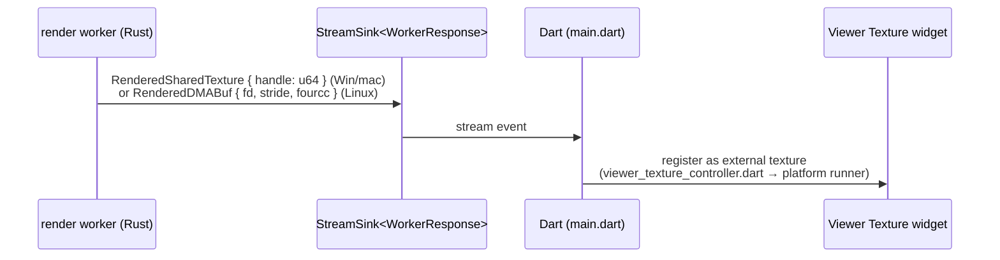

# The seam: lumit-bridge and lumit-keymap

`lumit-bridge` is the whole surface the Flutter frontend can call. It is a frontend
leaf — engine crates never depend on it. The canonical contract is
[17-BRIDGE-CONTRACT.md](../17-BRIDGE-CONTRACT.md). This doc is the tour of the code
that implements it.

## Generated, not hand-written

You write ordinary Rust in `crates/lumit-bridge/src/api/**`. Then
`flutter_rust_bridge_codegen generate` (run from `flutter_ui/`) writes both sides of
the glue. Those are `src/frb_generated.rs` (Rust) and `flutter_ui/lib/src/rust/`
(Dart — one `api/*.dart` per Rust api module). Never edit either by hand.

Both sides embed the same content hash. A stale library refuses to start. There is
no ABI version and no degraded mode. That is also why Flutter widget tests can drive
the real engine.

Attributes shape what Dart sees:

| Attribute | Effect |
|---|---|
| `#[frb(sync)]` | Runs on Dart's UI isolate. Only for fast calls — `save` and `open_project` are deliberately async |
| *(none)* | Async on frb's shared worker pool |
| `#[frb(non_opaque)]` | Struct/enum mirrored into Dart fields |
| `#[frb(opaque)]` | Stays a Rust-held handle (e.g. `BridgeEffectInstance`) |
| `#[frb(ignore)]` | Internal. Hidden from Dart |

## API shape: references, not snapshots

One module per panel-sized concern (`api/project.rs`, `composition.rs`, `layer.rs`,
`effect.rs`, `footage.rs`, `keymap.rs`, `audio.rs`, `export.rs`, `cache.rs`, …).
Dart holds small reference handles — `ProjectReference { id }`,
`CompositionReference { project, id }`, `LayerReference { project, comp, layer }` —
and calls methods on them. No document snapshot ever crosses the seam. Readers ask
the handle (`comp.get_layers()`, `layer.get_switches()`).

`new_project` is sync; `open_project` is **not**, and the asymmetry is deliberate. Reading a
`.lum` parses a whole document and stats every media file it names, which on the UI isolate
froze the window for as long as that took. Async puts it on a worker thread, which is what
lets Dart keep the previous document on screen behind a progress state until it returns. A
`.lum` that will not open comes back as `Ok(None)` rather than an error: an unopenable file is
the file picker's problem, and Dart shows its own notice.

## State and locks

Process-wide statics in `api/state.rs`:

- `PROJECTS: LazyLock<RwLock<BTreeMap<Uuid, Arc<RwLock<LumitBridgeState>>>>>`
- `STREAMS` — the per-project change sinks (a second registry, so the observer can
  reach a sink while a project lock is held)

`LumitBridgeState` holds the `DocumentStore` (document + undo), the file path, the
media cache, the crash-journal handle and the render worker's `Sender`.

The `PROJECTS` declaration in `state.rs` writes down the lock order, and that order is law. Take a registry,
clone the `Arc` out, and drop the guard. Then take one project `RwLock`. The observer
touches only STREAMS and the journal. Readers clone `store.snapshot()` (an
`Arc<Document>`), drop the guard, then work. Never hold a lock across an await, a GPU
call, or a render.

## Edits: one gesture, one op, one undo step

A UI action calls one method on a reference. The method builds one
`lumit_core::Op` and commits it (`LayerReference::set_transform` in `layer.rs` is the pattern). Ops carry whole
values — an entire animation, an entire effect stack — never granular deltas.

Drags do not commit. `render_frame_with_preview` and its siblings
(`…with_transform_`, `…with_text_`, `…with_paint_`, `…with_mask_`, `…with_retime`)
patch an engine-side clone per tick. Mouse-up commits once. `set_effects` refuses a
reordered stack (`StaleEffectStack`) rather than guessing.

Because every call to `render_frame_with_preview` is by definition a live drag, the worker
also renders those ticks small: `realtime.rs` picks the finest divisor of 1/2/3/4 whose
raster fits a 640×360 pixel budget, floored at Quarter (K-383). Dragging a Depth of field
radius otherwise left the picture seconds behind the pointer. This is a decision taken before
the first tick, not the adaptive tier, which needs a dozen measured frames and would still
stall the first drag. The rule lives here rather than in Dart so no new drag call site can
forget it, and a release comes back through `render_frame` at the Viewer's own scale.

Every keyframe crosses on the **composition's clock**. Conversion by the layer's
`start_offset` happens at the seam (K-213).

## Events: Rust → Dart

`DocumentStore`'s observer fires on every commit. It appends the op to the crash
journal. It computes `op_scope(&op)`, an exhaustive match where a new `Op` variant is
a compile error. It then pushes a `ScopedChange { project, item, layer, items }` down
the project's `StreamSink`. Dart listens in `main.dart` and rebuilds only the named
subtree. Edits invalidate nothing: frames are named by content hash, so an edit
renames exactly the frames it changed.

## Frames: a handle, not pixels

`ProjectReference::start_worker(stream)` spawns the render worker thread. Render and
playback requests are `#[frb(sync)]` channel sends. The worker owns a
`HeadlessRenderer` outright — no lock. It drains its queue latest-wins per class.
Scrub frames supersede each other, and Play/Stop are kept.

Publishing is zero-copy only (K-177/K-183):

**A still frame and a playback frame decide their quality separately** (K-372), and the two
functions in `api/worker_thread.rs` say which is which. `still_quality(scale)` is the scale the
caller asked for, full stop. `playback_quality(scale, mode, tier)` coarsens it by the
adaptive tier, and only when the run is Adaptive. When one function served both, scrubbing
after a playback run inherited whatever tier the run had drifted to — so the frame was made
at a scale nothing else would ask for, and every lookup missed. The idle background fill
derives its names through `still_quality` too, or it banks frames the scrub cannot find.

Two other things the Viewer sets rather than edits: `set_viewer_look` carries the whole look
in one call — exposure stops, tone map, transparent background, and the region of interest as
`[u0, v0, u1, v1]`. One call for all four, so the renderer can never hold half a look. The
region crosses as **fractions of the picture**, never pixels, because which pixel a point is
depends on the raster the engine settles on and that changes with preview resolution.
Anything that is not four sensible numbers *is* "no region": a drag that ends where it began
is a gesture, not an error. None of this is an op, and none of it reaches an export.

The only pixel payloads that cross as bytes are bounded stills: thumbnails,
256×256 scope traces, ≤129×129 colour-dropper windows (capped engine-side).
Playback lives in the worker (K-181). It renders ahead into a ring sized by p95 frame
cost. It presents on a time grid, pre-rolls audio, and chases the audio clock.
Settings cross as atomics (cache budgets, profiling switch). The worker polls them
once per loop.

## lumit-keymap through the seam

The keymap model (chords, contexts, actions, clash rules) is the engine crate
`lumit-keymap`. The bridge holds the session map in
`static KEYMAP: OnceLock<Mutex<Keymap>>`. Every keypress calls sync
`keymap_lookup(context, chord) -> Option<String>` (an action id). The stored keymap
file is Dart's. Imports apply on top of shipped defaults (K-302).

Engine display text (keymap action descriptions, effect and parameter labels) crosses
as **British English beside a stable id**. Dart translates on arrival via
`lib/l10n/engine_labels.dart` (K-303). Never build display text with `format!` on the
Rust side.

## Traps

- Never edit `src/frb_generated.rs` or `flutter_ui/lib/src/rust/**`. Change
  `api/**`, regenerate, commit both — `codegen-fresh` CI diffs the output.
- No panic may cross into Dart. Every surface fn returns `Result<_, BridgeError>`.
  The `no-panics-in-frb-api` grep enforces what clippy cannot see through the
  `#[frb]` macro.
- The change observer runs while the committer still holds the project write lock.
  Access to `PROJECTS` from the observer deadlocks on the first edit — that is why
  the journal is a shared `Arc`.
- Seconds-long work (beat analysis, probing) gets its own thread. The frb async
  pool is shared. Blocking it stalls every panel's reads.
- The API surface is identical in every feature build: functions degrade, never
  disappear.
