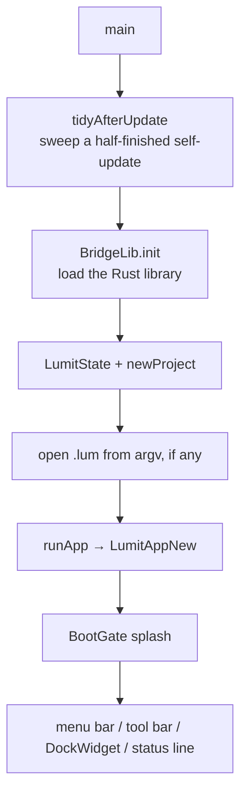
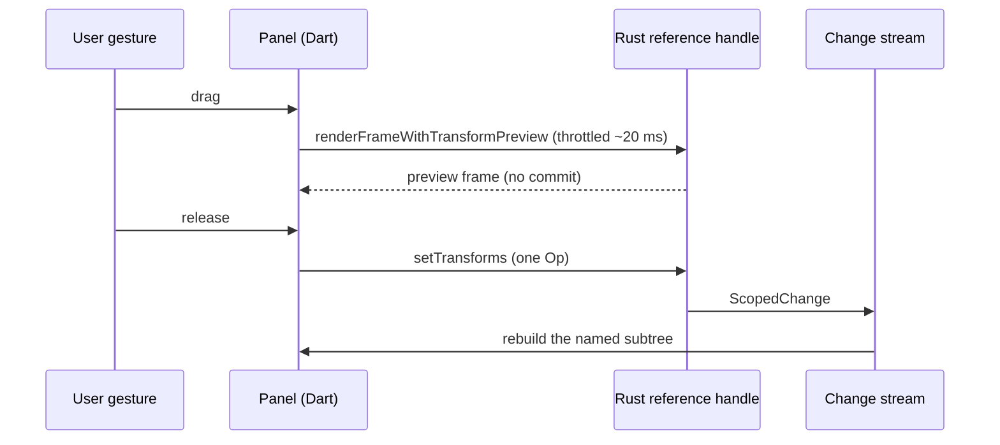

# The frontend: flutter_ui

The Flutter app owns pixels on screen, input, and every user-facing string. It holds
no document state: the document lives in Rust, and the app reads it through reference
handles.

Specs: [07-UI-SPEC.md](../07-UI-SPEC.md), [15-DESIGN.md](../15-DESIGN.md).
To learn the language, read [FLUTTER.md](FLUTTER.md).

## Layout

| Directory | Holds |
|---|---|
| `lib/main.dart` | Entry point, `LumitState`, `LumitUiState`, the global key handler |
| `lib/shell/` | Menu bar, tool bar, dock, status line, dialogs, settings, palette |
| `lib/panels/` | Timeline, Viewer, graph editor, effects, project, scopes |
| `lib/state/` | The read model, workspace persistence, keymap, tools, caches |
| `lib/widgets/` | The house control library (buttons, fields, modals, pickers) |
| `lib/theme/` | The only Dart files allowed a colour hex |
| `lib/l10n/` | `app_en.arb`, the `l10n` global, `engine_labels.dart` |
| `lib/src/rust/` | **Generated.** Never edited by hand |

The `_frb` suffix marks a file that speaks the typed Rust bridge. Pure files (dock
model, timecode, splash) have no suffix.

## Startup

`LumitAppNew` is a `MaterialApp` used only for infrastructure — there is no Material
chrome. It provides `LumitState` and `LumitUiState`, wraps everything in `ThemeScope`
and `UiScaleView`.

## Who owns state

Two `ChangeNotifier`s.

**`LumitState`** faces the engine: the `ProjectReference`, and subscriptions to two
Rust streams — the scoped document-change stream and the render worker stream.

**`LumitUiState`** holds session state as a bag of `ValueNotifier`s: playhead,
selection, playing, dropper, viewer look, plus sub-notifiers (`CompModel`,
`KeymapState`, `ToolsState`, `Workspace`, `UpdateService`). Cross-panel requests are
"bump an int" counters (`paletteRequest`, `togglePlayRequest`) — a way to ask a
possibly-unmounted panel to do something.

**The performance keystone is `CompModel`** (K-184): one `getModel()` bridge call per
committed change gives a read model that panels draw from. **Zero bridge calls per
rebuild or repaint.** Anything not in the model (FFmpeg probes, waveform peaks, layer
bounds) is fetched async off the build. The app caches it in State maps keyed by
document revision. `test/frb/bridge_call_budget_test.dart` enforces the budget.

`Workspace` persists layout, theme, settings, keymap and per-project sessions to one
JSON file.

## How an edit travels

One gesture is one op is one undo step. Panels call `ui.model.refresh()` themselves
after committing rather than waiting for the stream round trip.

## Drawing the panels

**The Timeline** is not virtualised: plain `Column`s of 22 px rows inside scroll
views. The outline half and the lane half are separate scroll views linked by
mirrored controllers. Both walk one row list. The halves can therefore draw
differently, but they never disagree about what a layer is. Heavy visuals are
`CustomPainter`s layered in `Stack`s, most with `hitTest => false` so gestures fall
through.

Time mapping is one object: `TimelineAxis { frames, width }` with `xOf`/`frameAt`,
shared by lanes, ruler, graph and cache bar. Zoom is a flight where **only the lane
half rebuilds** per tick (K-293). Layout applies the anchored offset, so offset and
content width never disagree.

**The Viewer** shows the engine's frame through a platform `Texture` widget.
`ViewerTextureController` registers the shared GPU handle over the
`lumit/viewer_texture` channel, receives a texture id, and announces `frameReady` per
frame. It latches itself unavailable and uses pixel readback instead, if frames are
announced but never drawn. The transport runs no clock. The engine paces playback,
and each published frame says which frame it is (K-181).

Tools and gizmos are overlay layers, inert unless armed. Geometry is pure:
`ViewerLayerMap` converts layer ↔ screen both ways. In-flight gestures preview by
rebuilding the box, not by re-reading the document.

**The graph editor** evaluates curves in Dart (`graph_maths.dart`). That code is a
line-for-line port of the engine's AE-style cubic, and golden tests hold it to the
engine. Painting a curve therefore crosses no bridge.

**Drags** accumulate raw pixels and derive frames from the running total. Rounding per
event reads as mouse acceleration. `snapFrame` measures candidates in *screen* pixels,
so zoom is the precision control. Ctrl suspends snapping.

## Theme and strings

Dark-first Aizome (K-004). `lib/theme/theme.dart` is the only Dart file allowed a hex
literal. Widgets read `ThemeScope.of(context).theme` and use semantic tokens
(`surface0..4`, `textPrimary..Disabled`, `hairline`, one `accent`). Add a new theme
field to `theme_tokens.dart` — a test enforces it.

Every string is `l10n.someKey`, backed by `app_en.arb`. Engine-sent English goes
through `engineLabel()`.

## Traps

- **No bridge calls in `build` or `paint`.** This is the recurring reviewed-out bug.
- **Unkeyed `Stack` children kill drags.** A child appearing mid-gesture rematches
  siblings by position and destroys the `GestureDetector` that holds the pointer.
  Give conditional children near a gesture a `ValueKey`.
- **Background painters eat gestures.** A `CustomPainter` hit-tests its whole rect by
  default. Decoration painters need `hitTest => false` or `IgnorePointer`.
- **Bridge handles move by value.** Calls like `setEffects` consume a
  `BridgeEffectInstance`. Reuse after the call throws mid-drag.
- **`dispose` cannot do ancestor lookups.** Capture `LumitUiState` in `initState`.
  Notifier writes from `dispose` are deferred to a post-frame callback.
- **Shortcuts are global `HardwareKeyboard` handlers**, not focus-tree `Shortcuts`.
  They become inactive for focused text fields and while a modal is open. Remove any
  handler you add in `dispose`, or tests fail on the leak.
