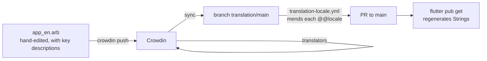

# Build, test, ship

How the repo turns into a running app, a green CI, a release, and a translated UI.

## The dev loop

The engine is a normal Cargo workspace. Build and test it from the repo root.
The app is a normal Flutter project. Run it from `flutter_ui/`. You do not build the
engine separately to run the app. The `rust_builder` plugin (vendored cargokit)
compiles `crates/lumit-bridge` inside every `flutter run`/`flutter build`.

```bash
# engine (repo root; on Windows dot-source scripts\win-dev-env.ps1 first)
cargo test --workspace                          # all engine tests
cargo test -p lumit-core                        # one crate
cargo test -p lumit-gpu -- --test-threads=1     # GPU oracles: always serial
cargo clippy --workspace --all-targets -- -D warnings
cargo fmt --all

# app (from flutter_ui/)
flutter run -d windows                          # build + launch
cargo build -p lumit_bridge                     # repo root, BEFORE flutter test
flutter test --concurrency=1                    # full Flutter suite, serial like CI
flutter analyze
```

Note the package-name trap: the Rust crate directory is `lumit-bridge`, but the
package Flutter builds is `lumit_bridge` (underscore). `cargo build -p lumit-bridge`
matches nothing.

## Three things regenerate

| You edit | Then run | Which writes |
|---|---|---|
| `crates/lumit-bridge/src/api/**` | `flutter_rust_bridge_codegen generate` (from `flutter_ui/`) | `flutter_ui/lib/src/rust/**` + Rust glue. Committed, never hand-edited. |
| `flutter_ui/lib/l10n/app_en.arb` | `flutter pub get` (or any build) | `lib/l10n/gen/` — the `Strings` class |
| Anything in the bridge crate | `cargo build -p lumit_bridge` | `target/debug/lumit_bridge.{dll,so,dylib}`, which `flutter_ui/test/frb/` loads (content-hash checked, stale = loud failure) |

Codegen versions are pinned: `flutter_rust_bridge` 2.12.0 exactly, Flutter 3.44.7 in
CI, Rust via `rust-toolchain.toml` (1.97.1). All three OSes link FFmpeg n7.1.

## CI: the merge gate

Nine jobs in `.github/workflows/ci.yml`. All block merge. None is advisory.

| Job | What it checks |
|---|---|
| `check` (macOS) | `cargo fmt --check`, clippy with `-D warnings`, full workspace tests, release check |
| `windows` | The shipping target: clippy + full tests with media. GPU oracles serial on WARP (software DX12) |
| `linux` | Same on lavapipe with `LUMIT_REQUIRE_GPU=1` (a skipped GPU test counts as failure). Bridge `--no-default-features` build |
| `flutter-linux` | `flutter analyze`, bridge build, `flutter test --concurrency=1`, DMA-BUF path clippy, release build. Includes `engine_labels_test.dart` |
| `flutter-macos` | `flutter build macos --release` (podspec + Swift runner compile gate) |
| `codegen-fresh` | Regenerates the bridge, `git diff --exit-code` — stale generated code fails |
| `coverage` (macOS) | `cargo llvm-cov` over `lumit-core/project/eval/cache/flow/text`, `--fail-under-lines 80`. Threshold only rises |
| `no-hex-outside-theme` | Greps for hex colours in `crates/` and colour literals in `flutter_ui/lib` outside `lib/theme/`. Also runs `scripts/check-icon.py` |
| `cargo-deny` + `no-panics-in-frb-api` | Licence/advisory/source policy. Grep for `unwrap`/`expect`/`panic!`/`todo!` in `crates/lumit-bridge/src/api/**` (the `#[frb]` macro hides these from clippy) |

Workspace-wide clippy denies (root `Cargo.toml`): `unwrap_used`, `expect_used`,
`panic`, `todo`, `unimplemented`, plus `unsafe_code = "deny"`. An unfinished branch
does not compile, by policy.

## Release

Push a `v*` tag. `release.yml` builds three artefact sets in parallel:

- **Windows** — Inno Setup `.exe` (per-user install under `{localappdata}`, no UAC,
  self-update model K-297) plus a plain `.zip` for the in-place updater. Unsigned.
- **Linux** — one single-file `.flatpak` (GNOME 49 runtime, FFmpeg bundled,
  `--filesystem=host` so footage anywhere is readable). The only Linux artefact.
- **macOS** — `.dmg` + `.zip`. Developer ID signed and notarised when the secrets
  exist, ad-hoc otherwise.

`publish` attaches them to a GitHub Release. A suffixed tag (`v0.2.0-rc1`) becomes a
pre-release and is not announced. `announce` posts
`web/src/content/releases/<version>.md` to Discord. The download page on
lumitlab.com queries the GitHub releases API at page load. A new tag therefore
updates the site with no deploy.

## Translations



Rules:

- Every user-facing string lives in `app_en.arb` with an `@key` description saying
  where it appears. Widgets read `l10n.someKey`. No inline strings.
- A string the **engine** sends (effect label, keymap action) needs the arb key
  **and** an entry in `lib/l10n/engine_labels.dart`. `engine_labels_test.dart` walks
  the Rust tables and fails on any gap.
- Never hand-edit `app_<locale>.arb` files other than `app_en.arb` — Crowdin
  overwrites them. Missing translations fall back to English. List new keys in the
  commit message and pull request, so the Crowdin upload is not forgotten.

## Packaging and the websites

- `packaging/windows/` — `build-installer.ps1` + `lumit.iss` (file associations for
  `.lum`/`.lumfx`/`.lumtheme`).
- `packaging/macos/make-dmg.sh` — bundles Homebrew FFmpeg dylibs, signs, notarises.
- `packaging/linux/` + `packaging/flatpak/` — desktop entry, MIME types, Flatpak
  manifest that repacks CI's staged bundle.
- `web/` (lumitlab.com, Astro + Tailwind) and `web-docs/` (docs.lumitlab.com, Astro
  Starlight): static sites on Cloudflare Workers, built and deployed by Cloudflare's
  git integration on push. Outside the Cargo workspace. Nothing depends on them.

Utility scripts: `scripts/win-dev-env.ps1` (FFmpeg + LLVM env for Windows),
`scripts/gen-icons.py` (regenerates committed icons from brand SVGs),
`scripts/check-icon.py` (rejects icon settings that crash actool, K-312),
`scripts/discord-release.mjs` (release announcements).

## Traps

- New engine-sent string without an `engine_labels.dart` entry: `flutter-linux` job
  fails. It is easy to add a keymap action without thinking of it as "a string".
- Any colour literal outside `flutter_ui/lib/theme/` (or hex in `crates/`): the hex
  lint fails. Colours come from the theme.
- Bridge API edited but codegen not re-run and committed: `codegen-fresh` fails. The
  fix is regenerate, never hand-edit `lib/src/rust/**`.
- `flutter test` run parallel, or against a stale bridge library: frb suites fail
  randomly (parallel) or loudly (stale hash). Serial, after `cargo build -p lumit_bridge`.
- `unwrap()` in `crates/lumit-bridge/src/api/**` passes clippy but fails the
  dedicated grep job.
- GPU tests run single-threaded everywhere. On Linux CI a skipped GPU test is a
  failure (`LUMIT_REQUIRE_GPU=1`).
